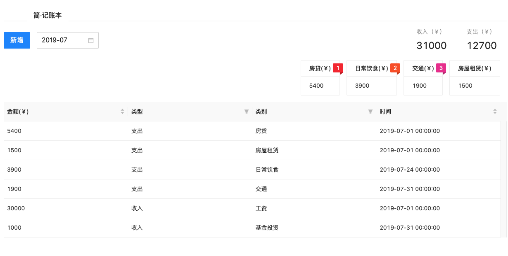

# XMindBill

This project was generated with [Angular CLI](https://github.com/angular/angular-cli) version 14.2.10.

## Preview


## 🖥 Environment Support
* node.Js > = 14.15.0
* Modern browsers including the following [specific versions](https://angular.io/guide/browser-support)
| Edge | last 2 versions | last 2 versions | last 2 versions | last 2 versions | last 2 versions

## 📦 Installation
You can install with npm or yarn

```bash
$ npm install
```

## Running unit tests

Run `npm run test` to execute the unit tests via [Karma](https://karma-runner.github.io).

## start

Run `npm run start` for a dev server. Navigate to http://localhost:4200/. The application will automatically reload if you change any of the source files.


